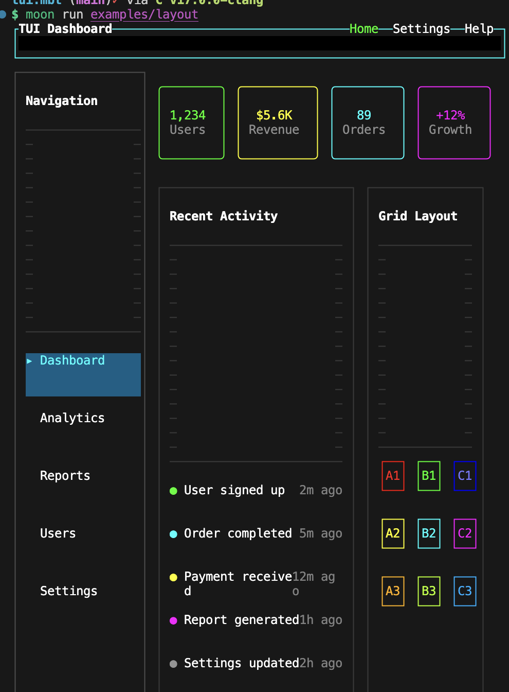

# mizchi/tui

Terminal UI library for MoonBit with reactive signals integration.

## Features

- ANSI rendering with diff-based updates
- Reactive signals integration (mizchi/signals)
- Component-based architecture (box, text, input, textarea, button)
- Keyboard and mouse input handling
- Layout powered by mizchi/crater



## Installation

```json
{
  "deps": {
    "mizchi/tui": "0.1.1"
  }
}
```

## Package Structure

```
mizchi/tui/
├── core/       # Component, Color, BorderChars, builders
├── events/     # InputEvent, parse_input, FocusManager
├── io/         # Platform I/O (print_raw, read_key, keypress)
├── render/     # App, ScreenBuffer, ANSI, layout
└── components/ # UI components (button, input, modal, etc.)
```

## Quick Start

```moonbit
import {
  "mizchi/tui/render" as @render,
  "mizchi/tui/core" as @core,
  "mizchi/tui/io" as @io,
  "mizchi/tui/events" as @events,
  "mizchi/tui/components" as @c,
  "mizchi/signals",
}

fn main {
  let (cols, rows) = @io.get_terminal_size()
  let count = @signals.signal(0)

  let app = @render.App::new(cols, rows)

  fn render_ui() -> @core.Component {
    @c.column([
      @c.text("Count: " + count.get().to_string()),
      @c.button("Increment"),
    ])
  }

  // Initialize terminal
  @io.print_raw(@render.App::init_terminal())

  // Render
  @io.print_raw(app.render_frame(render_ui()))

  // Cleanup
  @io.print_raw(@render.App::restore_terminal())
}
```

## Examples

- `examples/counter` - Simple counter with keyboard input
- `examples/chat` - Chat-like interface
- `examples/form` - Form with input fields
- `examples/button` - Button states and interactions
- `examples/layout` - Layout examples

Run examples:
```bash
moon run examples/counter
```

## License

MIT
